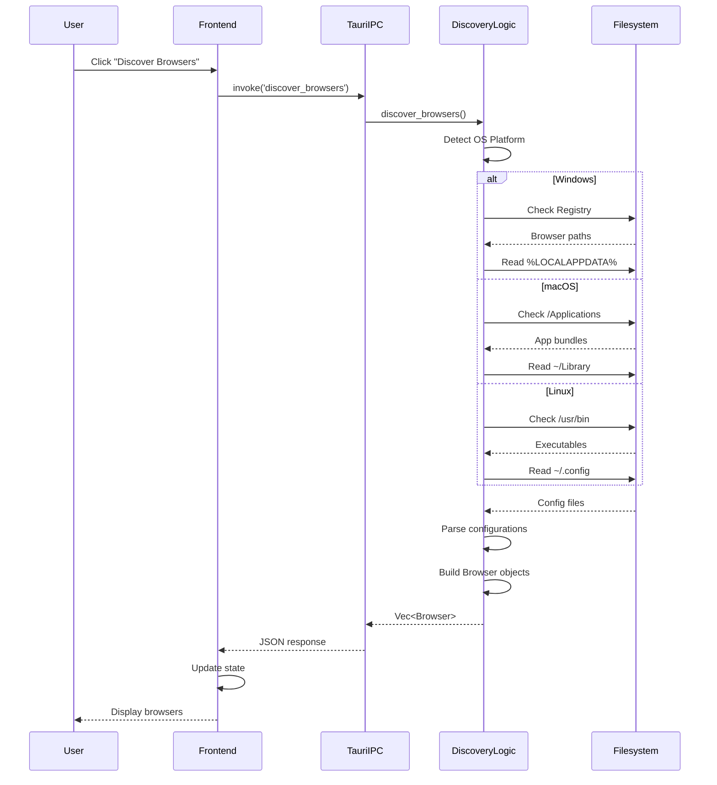
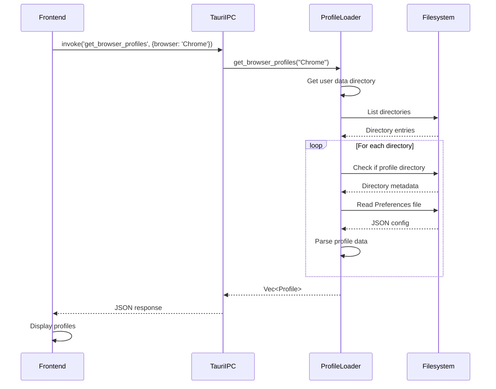
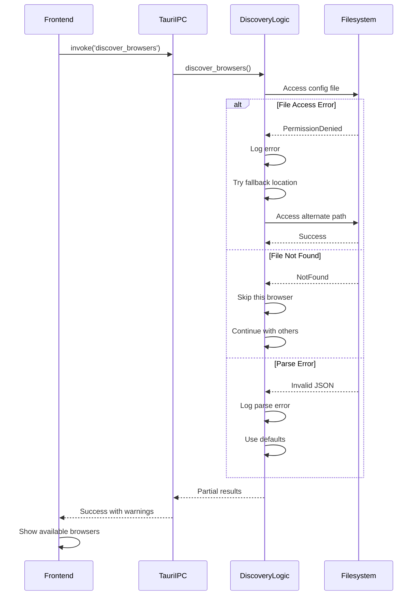

# Browser Discovery Overview

## Table of Contents
- [Introduction](#introduction)
- [Architecture Overview](#architecture-overview)
- [Discovery Flow](#discovery-flow)
- [Frontend Integration](#frontend-integration)
- [Tauri Commands](#tauri-commands)
- [Filesystem Access](#filesystem-access)
- [Sequence Diagrams](#sequence-diagrams)
- [Platform-Specific Implementation](#platform-specific-implementation)
- [Troubleshooting](#troubleshooting)
- [Performance Considerations](#performance-considerations)

## Introduction

The browser discovery system is responsible for detecting installed web browsers on the user's system, retrieving their configuration, and making this information available to the frontend application. This document explains the complete flow from a frontend request through the Rust backend to filesystem access.

## Architecture Overview

The browser discovery system follows a layered architecture:

```
┌─────────────────────────────────────────┐
│         Frontend (React/Vue/JS)         │
│    UI Components & State Management     │
└─────────────────┬───────────────────────┘
                  │
                  │ Tauri IPC
                  ▼
┌─────────────────────────────────────────┐
│         Tauri Command Layer             │
│    discover_browsers(), get_profiles()  │
└─────────────────┬───────────────────────┘
                  │
                  │ Rust Function Calls
                  ▼
┌─────────────────────────────────────────┐
│        Browser Discovery Logic          │
│   Platform Detection & Browser Finding  │
└─────────────────┬───────────────────────┘
                  │
                  │ File I/O Operations
                  ▼
┌─────────────────────────────────────────┐
│          Filesystem Layer               │
│   Config Files, Registry, App Bundles   │
└─────────────────────────────────────────┘
```

## Discovery Flow

### High-Level Process

1. **Frontend Request**: User action triggers browser discovery
2. **Tauri IPC**: Request serialized and sent to Rust backend
3. **Platform Detection**: System identifies OS (Windows/macOS/Linux)
4. **Browser Detection**: Known browser locations are checked
5. **Configuration Parsing**: Browser configs and profiles are read
6. **Response Serialization**: Data converted to JSON
7. **Frontend Update**: UI displays discovered browsers

## Frontend Integration

### Invoking Browser Discovery

```javascript
// Example: Discovering browsers from React component
import { invoke } from '@tauri-apps/api/tauri';

async function discoverBrowsers() {
  try {
    const browsers = await invoke('discover_browsers');
    console.log('Discovered browsers:', browsers);
    return browsers;
  } catch (error) {
    console.error('Failed to discover browsers:', error);
    throw error;
  }
}

// Example: Getting profiles for a specific browser
async function getBrowserProfiles(browserName) {
  try {
    const profiles = await invoke('get_browser_profiles', { 
      browser: browserName 
    });
    return profiles;
  } catch (error) {
    console.error('Failed to get profiles:', error);
    throw error;
  }
}
```

### State Management

```javascript
// Example: React hook for browser discovery
import { useState, useEffect } from 'react';

function useBrowserDiscovery() {
  const [browsers, setBrowsers] = useState([]);
  const [loading, setLoading] = useState(true);
  const [error, setError] = useState(null);

  useEffect(() => {
    async function loadBrowsers() {
      try {
        setLoading(true);
        const discovered = await invoke('discover_browsers');
        setBrowsers(discovered);
        setError(null);
      } catch (err) {
        setError(err.message);
      } finally {
        setLoading(false);
      }
    }

    loadBrowsers();
  }, []);

  return { browsers, loading, error };
}
```

## Tauri Commands

### Command Definitions

Tauri commands are Rust functions exposed to the frontend via the `#[tauri::command]` attribute.

```rust
// src-tauri/src/commands/browser_discovery.rs

#[tauri::command]
pub async fn discover_browsers() -> Result<Vec<Browser>, String> {
    match detect_installed_browsers().await {
        Ok(browsers) => Ok(browsers),
        Err(e) => Err(format!("Browser discovery failed: {}", e)),
    }
}

#[tauri::command]
pub async fn get_browser_profiles(browser: String) -> Result<Vec<Profile>, String> {
    match find_browser_profiles(&browser).await {
        Ok(profiles) => Ok(profiles),
        Err(e) => Err(format!("Failed to get profiles: {}", e)),
    }
}

#[tauri::command]
pub async fn get_browser_bookmarks(browser: String, profile: String) -> Result<Vec<Bookmark>, String> {
    match read_bookmarks(&browser, &profile).await {
        Ok(bookmarks) => Ok(bookmarks),
        Err(e) => Err(format!("Failed to read bookmarks: {}", e)),
    }
}
```

### Data Structures

```rust
#[derive(Debug, Serialize, Deserialize)]
pub struct Browser {
    pub name: String,
    pub version: String,
    pub path: PathBuf,
    pub profiles: Vec<Profile>,
    pub is_default: bool,
}

#[derive(Debug, Serialize, Deserialize)]
pub struct Profile {
    pub name: String,
    pub path: PathBuf,
    pub is_default: bool,
}
```

### Registering Commands

```rust
// src-tauri/src/main.rs

fn main() {
    tauri::Builder::default()
        .invoke_handler(tauri::generate_handler![
            discover_browsers,
            get_browser_profiles,
            get_browser_bookmarks,
        ])
        .run(tauri::generate_context!())
        .expect("error while running tauri application");
}
```

## Filesystem Access

### Windows Implementation

```rust
use std::env;
use std::path::PathBuf;
use winreg::enums::*;
use winreg::RegKey;

fn get_chrome_path_windows() -> Option<PathBuf> {
    // Check Program Files
    let program_files = env::var("ProgramFiles").ok()?;
    let chrome_path = PathBuf::from(program_files)
        .join("Google\\Chrome\\Application\\chrome.exe");
    
    if chrome_path.exists() {
        return Some(chrome_path);
    }

    // Check Registry
    let hklm = RegKey::predef(HKEY_LOCAL_MACHINE);
    let chrome_key = hklm
        .open_subkey("SOFTWARE\\Microsoft\\Windows\\CurrentVersion\\App Paths\\chrome.exe")
        .ok()?;
    
    let path: String = chrome_key.get_value("").ok()?;
    Some(PathBuf::from(path))
}

fn get_chrome_profiles_windows() -> Result<Vec<Profile>, Box<dyn Error>> {
    let local_app_data = env::var("LOCALAPPDATA")?;
    let user_data_dir = PathBuf::from(local_app_data)
        .join("Google\\Chrome\\User Data");

    let mut profiles = Vec::new();
    
    for entry in fs::read_dir(&user_data_dir)? {
        let entry = entry?;
        let path = entry.path();
        
        if path.is_dir() {
            let dir_name = path.file_name()
                .and_then(|n| n.to_str())
                .unwrap_or("");
                
            if dir_name.starts_with("Profile") || dir_name == "Default" {
                profiles.push(Profile {
                    name: dir_name.to_string(),
                    path: path.clone(),
                    is_default: dir_name == "Default",
                });
            }
        }
    }
    
    Ok(profiles)
}
```

### macOS Implementation

```rust
use std::path::PathBuf;

fn get_chrome_path_macos() -> Option<PathBuf> {
    let chrome_path = PathBuf::from("/Applications/Google Chrome.app");
    
    if chrome_path.exists() {
        Some(chrome_path)
    } else {
        None
    }
}

fn get_chrome_profiles_macos() -> Result<Vec<Profile>, Box<dyn Error>> {
    let home_dir = env::var("HOME")?;
    let user_data_dir = PathBuf::from(home_dir)
        .join("Library/Application Support/Google/Chrome");

    read_profiles_from_directory(&user_data_dir)
}
```

### Linux Implementation

```rust
fn get_chrome_path_linux() -> Option<PathBuf> {
    let possible_paths = vec![
        "/usr/bin/google-chrome",
        "/usr/bin/chromium-browser",
        "/usr/bin/chromium",
    ];

    for path_str in possible_paths {
        let path = PathBuf::from(path_str);
        if path.exists() {
            return Some(path);
        }
    }

    None
}

fn get_chrome_profiles_linux() -> Result<Vec<Profile>, Box<dyn Error>> {
    let home_dir = env::var("HOME")?;
    let user_data_dir = PathBuf::from(home_dir)
        .join(".config/google-chrome");

    read_profiles_from_directory(&user_data_dir)
}
```

## Sequence Diagrams

### Complete Discovery Flow



### Profile Loading Flow



### Error Handling Flow



## Platform-Specific Implementation

### Windows Specifics

**Registry Access:**
```rust
use winreg::enums::*;
use winreg::RegKey;

fn check_browser_registry() -> Result<String, Box<dyn Error>> {
    let hklm = RegKey::predef(HKEY_LOCAL_MACHINE);
    let key = hklm.open_subkey("SOFTWARE\\Clients\\StartMenuInternet")?;
    
    for subkey_name in key.enum_keys().map(|x| x.unwrap()) {
        println!("Found browser: {}", subkey_name);
    }
    
    Ok(())
}
```

**Environment Variables:**
- `%LOCALAPPDATA%`: User-specific application data
- `%APPDATA%`: Roaming user data
- `%ProgramFiles%`: Installed programs
- `%ProgramFiles(x86)%`: 32-bit programs on 64-bit systems

### macOS Specifics

**App Bundle Structure:**
```
/Applications/Google Chrome.app/
├── Contents/
│   ├── Info.plist          # App metadata
│   ├── MacOS/
│   │   └── Google Chrome   # Executable
│   └── Resources/
```

**User Data Locations:**
```
~/Library/Application Support/Google/Chrome/
~/Library/Application Support/Firefox/
~/Library/Application Support/Microsoft Edge/
```

### Linux Specifics

**Standard Locations:**
```
/usr/bin/              # System executables
/usr/share/applications/  # Desktop entries
~/.config/             # User configurations
~/.local/share/        # User data
```

## Troubleshooting

### Windows-Specific Edge Cases

#### 1. Permission Denied Errors

**Problem:** Cannot access browser profile directories
```
Error: Permission denied when reading C:\Users\...\AppData\Local\Google\Chrome
```

**Solutions:**
- Run application with elevated privileges
- Check Windows Defender/Antivirus settings
- Verify user has read permissions on profile directory
- Use `icacls` command to check permissions:
  ```cmd
  icacls "C:\Users\YourName\AppData\Local\Google\Chrome"
  ```

**Code Fix:**
```rust
use std::fs::metadata;

fn check_directory_access(path: &Path) -> bool {
    match metadata(path) {
        Ok(meta) => meta.permissions().readonly() == false,
        Err(_) => false,
    }
}
```

#### 2. Long Path Issues (Windows)

**Problem:** Paths exceeding MAX_PATH (260 characters)
```
Error: The filename or extension is too long
```

**Solutions:**
- Enable long path support in Windows 10+:
  ```reg
  HKEY_LOCAL_MACHINE\SYSTEM\CurrentControlSet\Control\FileSystem
  LongPathsEnabled = 1
  ```
- Use UNC path prefix: `\\?\C:\...`

**Code Fix:**
```rust
fn normalize_windows_path(path: &Path) -> PathBuf {
    let path_str = path.to_string_lossy();
    if path_str.len() > 260 && !path_str.starts_with("\\\\?\\") {
        PathBuf::from(format!("\\\\?\\{}", path_str))
    } else {
        path.to_path_buf()
    }
}
```

#### 3. Registry Redirection (32-bit vs 64-bit)

**Problem:** Can't find browser in registry on 64-bit Windows
```
Error: Registry key not found
```

**Solutions:**
- Check both 32-bit and 64-bit registry views
- Use `KEY_WOW64_64KEY` flag

**Code Fix:**
```rust
use winreg::enums::*;

fn check_both_registry_views(key_path: &str) -> Option<String> {
    // Try 64-bit view first
    if let Some(value) = read_registry(key_path, KEY_READ | KEY_WOW64_64KEY) {
        return Some(value);
    }
    
    // Fallback to 32-bit view
    read_registry(key_path, KEY_READ | KEY_WOW64_32KEY)
}
```

#### 4. Locked Database Files

**Problem:** Browser profile database is locked
```
Error: Database is locked (SQLite error)
```

**Solutions:**
- Close the browser before accessing
- Copy database to temp location first
- Use read-only mode

**Code Fix:**
```rust
use std::fs;

fn copy_locked_database(db_path: &Path) -> Result<PathBuf, Box<dyn Error>> {
    let temp_dir = env::temp_dir();
    let temp_db = temp_dir.join(format!("browser_db_{}.tmp", 
        std::process::id()));
    
    fs::copy(db_path, &temp_db)?;
    Ok(temp_db)
}
```

#### 5. User Profile Path with Special Characters

**Problem:** Username contains unicode or special characters
```
Error: Invalid path encoding
```

**Solutions:**
- Use proper UTF-16 encoding
- Handle OsString correctly

**Code Fix:**
```rust
use std::ffi::OsStr;
use std::os::windows::ffi::OsStrExt;

fn get_user_profile_windows() -> Result<PathBuf, Box<dyn Error>> {
    let user_profile = env::var_os("USERPROFILE")
        .ok_or("USERPROFILE not set")?;
    
    Ok(PathBuf::from(user_profile))
}
```

### General Troubleshooting

#### Browser Not Found

**Checklist:**
- [ ] Browser is actually installed
- [ ] Check all standard installation locations
- [ ] Verify portable/custom installations
- [ ] Check for browser updates that changed paths

#### Profile Detection Issues

**Checklist:**
- [ ] Profile directory exists and is accessible
- [ ] Preferences file is valid JSON
- [ ] Profile is not corrupted
- [ ] Check for multiple browser versions

#### Performance Problems

**Optimization Tips:**
- Cache discovered browsers
- Use async file operations
- Limit concurrent filesystem operations
- Implement timeout for slow operations

```rust
use tokio::time::{timeout, Duration};

async fn discover_with_timeout() -> Result<Vec<Browser>, Box<dyn Error>> {
    match timeout(Duration::from_secs(5), discover_browsers()).await {
        Ok(result) => result,
        Err(_) => Err("Discovery timeout".into()),
    }
}
```

### Debug Logging

Enable detailed logging for troubleshooting:

```rust
use log::{debug, info, warn, error};

fn discover_browsers_with_logging() -> Result<Vec<Browser>, Box<dyn Error>> {
    info!("Starting browser discovery");
    debug!("Platform: {}", std::env::consts::OS);
    
    let start = Instant::now();
    let browsers = detect_browsers()?;
    
    info!("Discovery completed in {:?}", start.elapsed());
    debug!("Found {} browsers", browsers.len());
    
    Ok(browsers)
}
```

## Performance Considerations

### Caching Strategy

```rust
use std::sync::Arc;
use tokio::sync::RwLock;

struct BrowserCache {
    browsers: Arc<RwLock<Option<Vec<Browser>>>>,
    last_update: Arc<RwLock<Option<Instant>>>,
}

impl BrowserCache {
    async fn get_or_discover(&self) -> Result<Vec<Browser>, Box<dyn Error>> {
        let last_update = self.last_update.read().await;
        
        if let Some(update_time) = *last_update {
            if update_time.elapsed() < Duration::from_secs(300) {
                // Cache is fresh (< 5 minutes)
                if let Some(browsers) = self.browsers.read().await.as_ref() {
                    return Ok(browsers.clone());
                }
            }
        }
        
        // Cache miss or stale, discover browsers
        let browsers = discover_browsers().await?;
        
        *self.browsers.write().await = Some(browsers.clone());
        *self.last_update.write().await = Some(Instant::now());
        
        Ok(browsers)
    }
}
```

### Async Operations

```rust
use tokio::task;

async fn discover_all_browsers_parallel() -> Result<Vec<Browser>, Box<dyn Error>> {
    let chrome = task::spawn(discover_chrome());
    let firefox = task::spawn(discover_firefox());
    let edge = task::spawn(discover_edge());
    
    let mut browsers = Vec::new();
    
    if let Ok(Ok(chrome_browser)) = chrome.await {
        browsers.push(chrome_browser);
    }
    if let Ok(Ok(firefox_browser)) = firefox.await {
        browsers.push(firefox_browser);
    }
    if let Ok(Ok(edge_browser)) = edge.await {
        browsers.push(edge_browser);
    }
    
    Ok(browsers)
}
```

## Related Documentation

- [Tauri Command API](https://tauri.app/v1/guides/features/command)
- [Filesystem Access in Tauri](https://tauri.app/v1/api/js/fs)
- [Windows Registry Access](https://docs.microsoft.com/en-us/windows/win32/sysinfo/registry)
- [Browser Profile Locations](../docs/browser-profiles.md)

---

**Last Updated:** 2024-10-15  
**Version:** 1.0.0